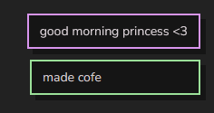

# macaron🍩

minimalistic toast notifications



**[demo](https://twink.codeberg.page/macaron)**

## usage

1. link to `macaron.css`:

```html
<link rel="stylesheet" href="https://unpkg.com/@twinking/macaron/dist/macaron.css" type="text/css"/>
```
2. link to `macaron.js`

```html
<script src="https://unpkg.com/@twinking/macaron/dist/macaron.js" type="text/javascript"></script>
```
3. use macaron

```js
macaron.success("hello from macaron!");
macaron.warn("do NOT touch my macarons");
```

## license

[Apache-2.0](LICENSE)
